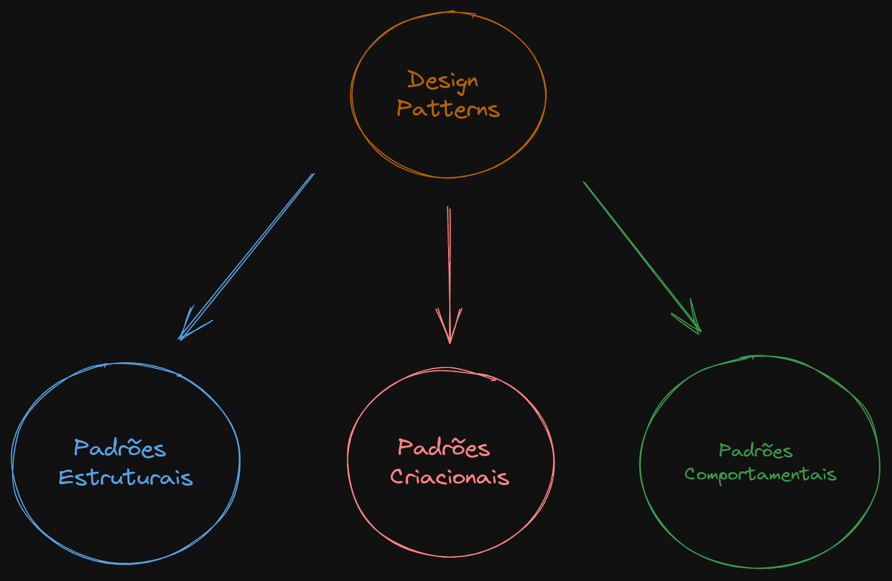

+++ 
draft = false
date = 2023-09-18T15:49:40-03:00
title = "Design Patters"
description = ""
slug = ""
authors = ["Abner Sousa"]
tags = ["Design Patters"]
categories = []
externalLink = ""
series = []
+++

# Ingles

Talvez, assim como eu, você tenha usado muito Data Transfer Object, Factory Method, Strategy, etc., mas não entende o porquê os utiliza, você só faz, porque viu num curso e gostou ou achou que seria bom para organizar o código e nesse ponto talvez tenha razão, mas será que é só isso? Esse artigo irá indagar e responder o porquê você deve usar Design Patterns nos seus projetos e as vantagens envolvidas.

# O que são Design Patterns?

Design Patterns são soluções customizáveis criadas para problemas corriqueiros do dia a dia do desenvolvedor. Imagine que você, ao construir uma nova aplicação, enfrente um problema já conhecido e resolvido anteriormente por outros desenvolvedores ao redor do mundo, você, provavelmente, não vai reinventar a roda e desenvolver uma solução totalmente nova sem que isso seja realmente necessário, é muito possível, que você vá usar uma solução já existente. 

Tal solução será um Design Pattern, porque você tem um problema que se repete e um mesmo conceito de solução para esse problema. Detalhe, não necessariamente será o mesmo código para o mesmo problema, o código-solução pode ser adaptado conforme as suas necessidades.

# Quais os principais grupos de Design Patters?

#### Padrões Criacionais

* Abstraem e/ou adiam o processo criação dos objetos;
* Fornecem mecanismos de criação de objetos que aumentam a flexibilidade e a reutilização do código existente.

#### Padrões Estruturais

* Preocupam-se com a forma como classes e objetos são compostos para formar estruturas maiores;
* Explicam como montar objetos e classes em estruturas maiores, mantendo as estruturas flexíveis e eficientes.

#### Padrões Comportamentais

* Concentram-se nos algoritmos e atribuições de responsabilidades entre os objetos;
* Cuidam de uma comunicação eficaz e da atribuição de responsabilidades entre objetos.

Bons exemplos de padrões criacionais, estruturais e comportamentais são Factory Method, Adapter e Strategy, respectivamente.

# Por que usar ou, no mínimo, conhecer Design Patterns?

* Conhecer alguns Design Patterns ajuda você a evitar pensar em soluções novas para problemas antigos, assim você pode focar no que realmente importa.

* Os Design Patterns compravadamente orientam na resolução do problema, são conceitos que já foram provados e testados, porque já foram pensadas por desenvolvedores experientes que passaram por esses problemas milhares de vezes. Imagine sempre ter que criar e validar uma nova solução para um mesmo problema, não muito faz sentido, certo?

* Melhora o entendimento do seu código por parte dos seus colegas. Ler o código de outro desenvolvedor é um tanto complicado n'é? Principalmente, se você tá começando, porém, se você conhece um pouco Design Patterns, no momento em que vir uma classe chamada ProductDAO, você vai saber de cara que essa classe trata de persistência de dados ou EntityManagerFactory você vai entender que se trata de uma classe cujo objetivo é sempre instanciar uma classe EntityManager e retorná-la, mesmo sem ter visto a implementação do código.

* Cria uma linguagem comum entre desenvolvedores, pois quando você já conhece um determinado padrão que resolve um problema que seu colega está passando, você só diz, "usa DAO para resolver isso", não precisando perder tempo explicando toda a solução, tendo em vista que seus colegas já vão entender nas entrelinhas.

# Conclusão

O principal ponto é que muitos problemas que você passa ao desenvolver um programa podem já estar especificados como um Design Pattern, então vale a pena estudar alguns deles aqui e ali, talvez faça você destravar naquele problema que você tá tendo dificuldade e ainda por cima melhorar a estrutura do seu projeto. Se aventure um pouco, tenho que certeza que valerá a pena!

# Referências

- [GofPattern](https://www.gofpattern.com/design-patterns/module2/design-pattern-benefits.php)
- [Refactoring Guru](https://refactoring.guru/pt-br)
- [Gran Cursos Online](https://blog.grancursosonline.com.br/padroes-de-projetos-gof-dicas-de-memorizacao-e-questoes-de-concursos/)